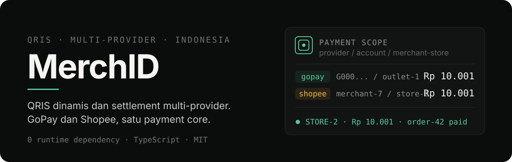
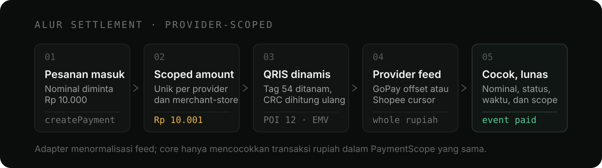
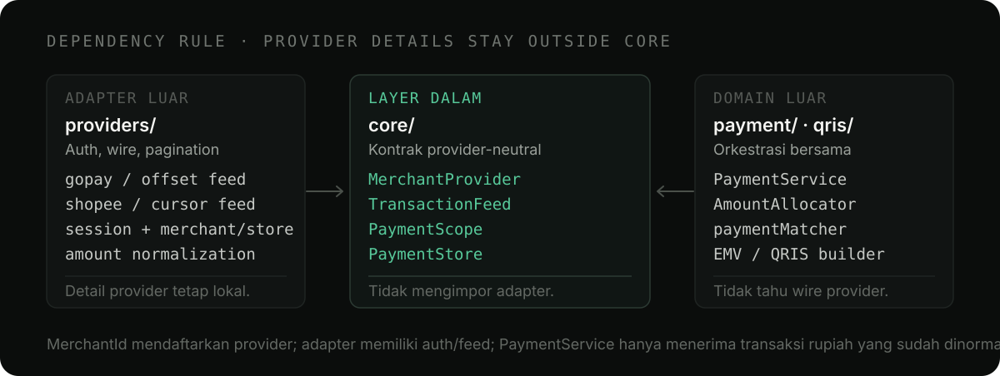

<p align="center">
  
</p>

<p align="center">
  <a href="https://www.npmjs.com/package/merchid"></a>
  <a href="#dukungan-runtime"></a>
  <a href="#lisensi"></a>
</p>

# MerchID

MerchID adalah toolkit payment-provider TypeScript untuk merchant Indonesia. Library ini mengubah QRIS statis menjadi QRIS dinamis per pesanan, membaca feed transaksi merchant, dan mencocokkan settlement berdasarkan nominal unik.

Provider bawaan saat ini:

| Provider                    | Adapter          | Autentikasi                                | Feed transaksi              | QRIS statis                                 |
| --------------------------- | ---------------- | ------------------------------------------ | --------------------------- | ------------------------------------------- |
| GoPay Merchant / GoBiz      | `GopayProvider`  | OTP GoID, access token, refresh token      | Offset pagination GoBiz     | Ditemukan dari outlet atau diberikan manual |
| Shopee Merchant / ShopeePay | `ShopeeProvider` | OTP fetch-only, cookie jar, merchant token | Cursor pagination ShopeePay | Diberikan manual dan terikat ke store       |

`MerchID` menjadi registry untuk mendaftarkan adapter dan memilih provider aktif tanpa menyatukan detail autentikasi masing-masing provider.

> **Klien tidak resmi.** Provider memakai endpoint privat yang tidak berdokumentasi dan dapat berubah tanpa pemberitahuan. Gunakan hanya dengan akun merchant milik Anda sendiri. Jangan menyimpan token, cookie, OTP, atau payload konfigurasi di log maupun repository.

## Instalasi

```bash
npm install merchid
```

MerchID tidak memiliki dependency runtime dan memakai `fetch` global. Node.js 18 atau runtime lain dengan Web Fetch API dapat menjalankan library.

## Komposisi multi-provider

`MerchID` adalah registry dan composition root. Ia tidak menyamakan alur login provider yang memang berbeda.

```ts
import { MerchID, GopayProvider, ShopeeProvider } from "merchid";

const gopay = new GopayProvider({
  merchantId: "G000000001",
  staticQris: process.env.GOPAY_STATIC_QRIS,
  session: gopaySession,
});

const shopee = new ShopeeProvider({
  merchantId: "123456789",
  storeId: "987654321",
  staticQris: process.env.SHOPEE_STATIC_QRIS,
  staticQrisScope: {
    merchantId: "123456789",
    storeId: "987654321",
  },
  session: shopeeSession,
});

const merchid = new MerchID({
  providers: [gopay, shopee],
  defaultProviderId: "gopay",
});

console.log(merchid.listProviders());
const active = merchid.getProvider();
console.log(active.providerId, active.authenticated);
```

Registry menangani pendaftaran, pemilihan default, status ringkas, dan ekspor sesi. Login, discovery merchant/store, transaksi, serta pembayaran tetap dipanggil pada adapter konkret agar detail provider tidak bocor ke core.

## GoPay Merchant

### Login lewat CLI

```bash
npx merchid login gopay
npx merchid merchants gopay
npx merchid set-merchant G000000001 --provider gopay
npx merchid whoami
```

CLI menyimpan konfigurasi provider-keyed di `~/.merchid/config.json`. Simpan file itu sebagai kredensial privat.

### Membuat dan memantau pembayaran

```ts
import { GopayProvider } from "merchid";

const gopay = new GopayProvider({
  merchantId: "G000000001",
  staticQris: "000201010211...",
  session: sessionFromSecretStore,
  onTokenRefreshed: async (session) => {
    await saveSecret("gopay-session", session);
  },
});

const payments = gopay.payments();
payments.on("paid", (payment) => {
  console.log("lunas", payment.reference, payment.uniqueAmount);
});
payments.on("expired", (payment) => {
  console.log("kedaluwarsa", payment.reference);
});
payments.on("error", (error) => {
  console.error("polling gagal", error);
});
payments.start();

const payment = await gopay.createPayment({
  amount: 10_000,
  reference: "order-42",
});

console.log(payment.uniqueAmount); // 10001, pembeli harus membayar persis
await displayQrLocally(payment.qrString); // jangan tulis payload QRIS mentah ke log
```

Untuk Worker, Edge, Lambda, atau proses tanpa timer persisten, jangan gunakan `start()`. Panggil `tick()` dari scheduler platform:

```ts
const { paid, expired } = await gopay.payments().tick();
```

## Shopee Merchant

Shopee menggunakan alur OTP fetch-only. Implementasi tidak membutuhkan browser, Playwright, Puppeteer, atau dependency cookie eksternal.

### Login OTP, merchant, dan store

```ts
import { ShopeeProvider } from "merchid";

const shopee = new ShopeeProvider({
  onSessionUpdated: async (session) => {
    await saveSecret("shopee-session", session);
  },
});

// Langkah 1: mengirim OTP. Gunakan nomor dalam format internasional.
// `password` wajib bila akun dilindungi password: tanpa itu Shopee melaporkan
// sukses tetapi menahan pengiriman kodenya.
const challenge = await shopee.requestOtp("6281234567890", {
  password: passwordFromUser,
});

// Langkah 2: memverifikasi OTP dan mendapatkan daftar merchant.
const verification = await shopee.verifyOtp({
  challenge,
  otp: otpFromUser,
});

const merchant = verification.merchants.find(
  (item) => item.isActive && !item.isBanned,
);
if (!merchant) throw new Error("Tidak ada merchant Shopee yang dapat dipakai");

// Langkah 3: menukar hasil verifikasi menjadi sesi merchant.
let session = await shopee.completeLogin({
  verification,
  merchantId: merchant.id,
});

// Akun multi-store mungkin membutuhkan pilihan eksplisit.
if (!session.storeId) {
  const stores = await shopee.listStores();
  const selected = stores[0];
  if (!selected) throw new Error("Tidak ada store Shopee yang dapat dipakai");
  session = await shopee.selectStore(selected.id);
}

await saveSecret("shopee-session", session);
```

`ShopeeOtpChallenge`, `ShopeeOtpVerification`, dan `ShopeeSession` berisi cookie atau state autentikasi sensitif. Jangan mengirim objek tersebut ke browser, mencetaknya ke log, atau menyimpannya sebagai fixture.

Untuk memulihkan sesi beserta QRIS yang sudah diikat ke merchant/store:

```ts
const shopee = new ShopeeProvider({
  session: sessionFromSecretStore,
  staticQris: qrisFromSecretStore.payload,
  staticQrisScope: qrisFromSecretStore.scope,
  onSessionUpdated: saveShopeeSession,
});
```

#### Pengiriman OTP dan device report

Shopee menilai laporan device-risk sebelum benar-benar mengirim OTP. Bila laporannya tidak dikenali, semua endpoint tetap melaporkan sukses tetapi kodenya ditahan diam-diam. `ShopeeProvider` menerima laporan itu lewat opsi `deviceReport`:

```ts
const shopee = new ShopeeProvider({ deviceReport: reportFromYourBrowser });
```

Tangkap laporan dari browser Anda sendiri. Paket ini juga mengekspor `SHOPEE_DEVICE_RISK_BLOB`, sebuah laporan hasil tangkapan satu mesin — memakainya berarti setiap pengguna melapor sebagai device yang sama, yang dapat ditautkan Shopee dan dapat diblokir sekaligus untuk semua orang. Lihat [Penafian](#penafian).

Bila OTP tidak kunjung datang, gunakan `importSession()` di bawah.

#### Mengadopsi sesi dari login browser

Alternatif tanpa OTP sama sekali: login di situs resmi Shopee, salin cookie `__shopee_partner_website_x_token_live`, lalu serahkan ke library.

```ts
const session = await shopee.importSession(tokenCookieFromBrowser);
```

Discovery, feed transaksi, dan rekonsiliasi berjalan normal setelahnya. Sesi hasil impor tidak bisa berganti merchant atau diperbarui otomatis — keduanya butuh materi SSO yang hanya ada pada login OTP.

#### Ganti merchant tanpa OTP baru

Satu akun dapat mengakses beberapa merchant. `selectMerchant()` mencetak ulang token untuk merchant tujuan dengan mengulang pertukaran SSO login, tanpa OTP baru:

```ts
const merchants = shopee.merchants; // dari sesi login
const session = await shopee.selectMerchant(targetMerchantId);
```

Store merchant tujuan ditemukan ulang otomatis. Penggantian ditolak selama scope aktif masih punya payment berjalan.

#### Memperbarui sesi

`exp` pada cookie dashboard Shopee berumur ~1000 hari dan **tidak** mencerminkan sesi server, jadi jangan memakainya untuk menilai sesi masih hidup. Selama sesi akun masih aktif, token merchant dapat dicetak ulang tanpa OTP:

```ts
try {
  await shopee.refreshSession();
} catch (error) {
  // AUTH_REQUIRED: sesi akun sudah mati, hanya login OTP baru yang memulihkan.
}
```

Token berotasi setiap pembaruan, jadi `onSessionUpdated` wajib dipasang agar sesi tersimpan tidak menjadi basi. Sesi hasil `importSession()` dan sesi lama tanpa materi SSO akan menolak dengan `AUTH_REQUIRED`.

### CAPTCHA

Bila Shopee meminta CAPTCHA, library melempar `CaptchaRequiredError` dengan code `CAPTCHA_REQUIRED`:

```ts
import { CaptchaRequiredError } from "merchid";

try {
  await shopee.requestOtp("6281234567890");
} catch (error) {
  if (error instanceof CaptchaRequiredError) {
    // Hentikan otomasi dan selesaikan verifikasi lewat alur resmi Shopee.
  } else {
    throw error;
  }
}
```

Library tidak mencoba melewati CAPTCHA.

### QRIS statis manual dan pembayaran

Dashboard API yang diamati tidak menyediakan payload QRIS statis Shopee. Setelah merchant dan store dipilih, ikat payload QRIS ke scope aktif:

```ts
const payload = process.env.SHOPEE_STATIC_QRIS;
if (!payload) throw new Error("SHOPEE_STATIC_QRIS belum diisi");

shopee.setStaticQris(payload);
await saveSecret("shopee-qris", {
  payload: shopee.staticQris,
  scope: shopee.staticQrisScope,
});
```

CLI melakukan binding yang sama secara otomatis:

```bash
npx merchid set-qris shopee
```

Setelah sesi, store, dan QRIS tersedia:

```ts
const payment = await shopee.createPayment({
  amount: 30_000,
  reference: "order-shopee-17",
});

const result = await shopee.payments().tick();
console.log(result.paid, result.expired);
```

Scope Shopee memakai merchant bisnis sebagai `accountId` dan store terpilih sebagai `merchantId`. QRIS hanya aktif ketika `staticQrisScope` cocok dengan merchant/store itu. Store lain tidak mewarisi QRIS lama.

`selectStore()` menolak perpindahan bila scope lama masih memiliki payment aktif. Service rekonsiliasi disimpan per scope agar karantina nominal dan transaction id yang sudah terpakai tidak hilang saat berpindah lalu kembali. Selama login, discovery, atau pergantian store, seluruh service terkait dihentikan sampai perubahan sesi berhasil dipersist. Jika operasi gagal, sesi, cookie, dan polling sebelumnya dipulihkan.

Reference `PaymentService` dari store lama menjadi inactive; `createPayment()`, `cancelPayment()`, `start()`, dan `tick()` akan ditolak. Ambil kembali service aktif melalui `shopee.payments()` setelah transisi selesai. `listStores()` tidak membuang service. Jika berpindah store, jalankan `set-qris shopee` atau `setStaticQris()` untuk store baru sebelum membuat QR payment.

## Model pembayaran bersama



Semua adapter menggunakan alur inti yang sama:

1. `AmountAllocator` memilih nominal akhir unik dalam scope provider/account/merchant-store.
2. `staticToDynamicQris` menambahkan tag nominal EMV `54`, mengubah QRIS menjadi dinamis, dan menghitung ulang CRC.
3. Adapter provider mengambil serta menormalisasi feed menjadi rupiah utuh.
4. `PaymentService` mencocokkan nominal, status, waktu, dan scope.
5. Satu transaksi hanya boleh melunasi satu pembayaran.

Contoh alokasi:

```text
Pesanan A  Rp 10.000  ->  Rp 10.001
Pesanan B  Rp 10.000  ->  Rp 10.002
Pesanan C  Rp 12.500  ->  Rp 12.501
```

Keunikan berlaku pada nominal akhir, bukan hanya offset. `3500 + 1` dan `3499 + 2` sama-sama menghasilkan `3501`, sehingga keduanya tidak boleh aktif pada scope yang sama.

### API pembayaran

| Method                           | Kegunaan                                                                      |
| -------------------------------- | ----------------------------------------------------------------------------- |
| `createPayment(input)`           | Membuat pembayaran pending dengan nominal unik dan QRIS dinamis bila tersedia |
| `payments().getPayment(id)`      | Mengambil satu pembayaran                                                     |
| `payments().cancelPayment(id)`   | Membatalkan pembayaran pending                                                |
| `payments().tick()`              | Menjalankan satu putaran rekonsiliasi                                         |
| `payments().start()` / `stop()`  | Mengelola polling background                                                  |
| `payments().on(event, listener)` | Event `paid`, `expired`, dan `error`                                          |

## PaymentScope dan PaymentStore

Setiap pembayaran baru menyimpan kepemilikan eksplisit:

```ts
interface PaymentScope {
  provider: string;
  accountId?: string;
  merchantId: string;
}
```

`PaymentStore` bersama wajib menghormati scope pada `listActive(scope)`. `PaymentService` memfilter ulang hasilnya sebagai pertahanan tambahan, tetapi store persisten tetap harus menegakkan keunikan nominal aktif per scope secara atomik.

```ts
import type { Payment, PaymentScope, PaymentStore } from "merchid";

class DatabasePaymentStore implements PaymentStore {
  async create(payment: Payment): Promise<void> {
    // Gunakan transaksi database dan unique constraint pada scope + uniqueAmount
    // untuk baris yang masih pending.
    await db.payments.insert(payment);
  }

  async update(payment: Payment): Promise<void> {
    await db.payments.update(payment.id, payment);
  }

  async get(id: string): Promise<Payment | undefined> {
    return db.payments.get(id);
  }

  async listActive(scope?: PaymentScope): Promise<Payment[]> {
    return db.payments.listPending(scope);
  }
}
```

`InMemoryPaymentStore` hanya cocok untuk test atau satu proses. State, karantina nominal, dan ingatan transaksi yang sudah dipakai tidak dapat mengoordinasikan beberapa proses. Deployment multi-instance harus memindahkan jaminan itu ke penyimpanan tahan lama.

## CLI dan konfigurasi

Binary utama:

```bash
merchid login [gopay|shopee]
merchid session [gopay|shopee]
merchid session [gopay|shopee] --reveal
merchid merchants [gopay|shopee]
merchid stores [gopay|shopee]
merchid whoami
merchid set-provider <gopay|shopee>
merchid set-merchant <merchantId> --provider gopay
merchid set-store <storeId>
merchid set-qris [gopay|shopee]
```

Lokasi default adalah `~/.merchid/config.json`. Gunakan `MERCHID_CONFIG` untuk memilih lokasi lain. File harus mengikuti schema version 1 berikut:

```jsonc
{
  "version": 1,
  "defaultProvider": "shopee",
  "providers": {
    "gopay": {
      "session": { "tokens": {}, "deviceId": "..." },
      "merchants": [],
      "defaultMerchantId": "G000000001",
      "staticQris": "000201...",
    },
    "shopee": {
      "session": { "version": 1, "cookies": [], "merchant": {}, "stores": [] },
      "staticQris": "000201...",
      "staticQrisScope": {
        "merchantId": "123456789",
        "storeId": "987654321",
      },
    },
  },
}
```

Contoh di atas hanya menunjukkan bentuk, dan sengaja tanpa trailing comma: file config dibaca dengan `JSON.parse`, sehingga koma di akhir akan ditolak. Jangan menyalin konfigurasi asli ke issue. `session` GoPay memuat access/refresh token, sedangkan sesi Shopee memuat cookie yang dapat memberi akses merchant. QRIS Shopee juga sensitif dan metadata owner-nya mencegah payload dipakai pada store berbeda. `session --reveal` hanya boleh dipakai di terminal privat.

## Penanganan error

`MerchIDError` adalah base error publik untuk seluruh kegagalan bertipe yang disurface-kan library.

```ts
import { MerchIDError, HttpError } from "merchid";

try {
  await provider.createPayment({ amount: 10_000 });
} catch (error) {
  if (error instanceof HttpError) {
    console.error("HTTP", error.status);
  } else if (error instanceof MerchIDError) {
    console.error(error.code, error.message);
  } else {
    throw error;
  }
}
```

| Code                    | Penyebab umum                                                 |
| ----------------------- | ------------------------------------------------------------- |
| `CONFIG_INVALID`        | Scope, merchant/store, QRIS, atau nominal tidak valid         |
| `AUTH_REQUIRED`         | Operasi membutuhkan sesi yang belum tersedia                  |
| `AUTH_FAILED`           | OTP ditolak, token/cookie kedaluwarsa, atau sesi dicabut      |
| `CAPTCHA_REQUIRED`      | Shopee meminta verifikasi CAPTCHA resmi                       |
| `HTTP_ERROR`            | Response HTTP non-2xx atau timeout                            |
| `API_ERROR`             | Provider mengembalikan error aplikasi atau cursor tidak valid |
| `AMOUNT_POOL_EXHAUSTED` | Semua offset pada scope sedang terpakai                       |
| `QRIS_PARSE_ERROR`      | Payload QRIS atau nominal EMV tidak valid                     |

## Catatan produksi

### GoPay: satuan feed harus dibagi tepat 100

GoBiz `merchant-analytics/v2` mengirim satuan minor ISO 4217. Rp 3.001 datang sebagai `gross_amount: 300100`. `TransactionClient` membagi tepat dengan 100. Nilai pecahan sengaja tidak dibulatkan agar gagal cocok dengan aman.

Jangan membuat matcher menerima skala mentah dan skala rupiah sekaligus. Transaksi Rp 300.100 dapat keliru melunasi pesanan Rp 3.001.

### GoPay: page size maksimum 100

Feed GoBiz menolak `size > 100` dengan HTTP 422. MerchID meng-clamp page size dan memindai sampai 10 halaman per tick. Jendela dimulai dari pembayaran aktif tertua, dikurangi `clockSkewMs`, dengan plafon bergulir 24 jam.

Jika outlet lebih sibuk dari kapasitas itu, pendekkan masa berlaku pembayaran. Jangan menaikkan page size melewati limit API.

### GoPay: status dan timestamp tidak dikenal sengaja fail-open

Matcher menolak status gagal yang dikenal, tetapi menerima status kosong/tidak dikenal dan timestamp yang tidak dapat diparse. Feed privat dapat berubah label. Mengubah perilaku ini menjadi fail-closed dapat membuat pembayaran sah tidak pernah terdeteksi.

Perubahan pada kebijakan ini wajib disertai test yang membuktikan arah sukses dan gagal.

### Settlement sebelum expiry

Rekonsiliasi dilakukan sebelum penandaan kedaluwarsa. Pembayaran baru menjadi expired setelah `expiresAt + clockSkewMs`, yaitu saat matcher juga berhenti menerima transaksi. Ini menahan jeda indexing feed agar uang yang dibayar tepat waktu tidak kehilangan pesanannya.

### Karantina nominal dan transaksi terkonsumsi

Nominal yang dilepas dikarantina selama `2 x clockSkewMs`. ID transaksi yang telah melunasi pembayaran diingat lintas tick selama masih mungkin muncul di jendela feed. Kedua penjagaan mencegah satu transfer lama melunasi pembayaran baru yang kebetulan memakai ulang nominal sama.

### GoPay: refresh token

GoID hanya menerima refresh token di dalam objek `data`:

```jsonc
{
  "client_id": "...",
  "data": { "refresh_token": "..." },
  "grant_type": "refresh_token",
}
```

Bearer pada request refresh sengaja kosong agar refresh reaktif setelah `401` tetap mungkin. Refresh token baru dari server harus diadopsi. Respons tidak selalu menyediakan `expires_in`, dan access token berbentuk JWE yang tidak dapat dibaca klaim `exp`-nya, sehingga fallback expiry 30 menit adalah perkiraan konservatif.

Login dari perangkat lain dapat mencabut sesi. Surface `AUTH_FAILED` sebagai kebutuhan login ulang, bukan sebagai status belum dibayar.

### Shopee: normalisasi ketat

Shopee mengirim nominal seperti `"30.000"`. Parser hanya menerima digit polos atau kelompok ribuan Indonesia yang valid. Nilai ambigu seperti `"30.00"`, desimal, simbol mata uang, dan angka di luar safe integer ditolak.

Hanya status numerik `3` yang dinormalisasi menjadi `completed`. Status lain menjadi label non-sukses `shopee:<kode>` dan tidak boleh dianggap lunas tanpa bukti baru.

Feed menggunakan cursor `next_position`. Adapter mendeteksi cursor yang berulang dan melaporkan truncation bila `maxPages` tercapai. Jangan memaksakan pagination offset GoPay ke Shopee.

### Masa berlaku default

Default pembayaran adalah 5 menit. Feed dapat terlambat mengindeks transaksi, terutama bila scheduler Anda berjalan jarang. Sesuaikan `payment.defaultExpiryMs` agar setidaknya mencakup interval scheduler dan keterlambatan feed yang realistis.

## Utilitas QRIS

```ts
import { isValidQrisChecksum, parseEmv, staticToDynamicQris } from "merchid";

const dynamic = staticToDynamicQris(staticPayload, 10_001);
isValidQrisChecksum(dynamic); // true
parseEmv(dynamic).get("54"); // "10001"
```

## Dukungan runtime

| Runtime                | Status           | Pola rekonsiliasi                              |
| ---------------------- | ---------------- | ---------------------------------------------- |
| Node.js 18+            | Diuji di CI      | `start()` atau scheduler dengan `tick()`       |
| Cloudflare Workers     | Belum diuji      | Cron/Alarm memanggil `tick()`                  |
| Vercel Edge, Deno, Bun | Belum diuji      | Scheduler platform memanggil `tick()`          |
| Browser                | Tidak dianjurkan | Jangan tempatkan kredensial merchant di client |

CI menjalankan Node 18 dan 24 di Linux serta Node 24 di Windows. Runtime lain **diharapkan** bekerja tetapi belum diverifikasi: core dan API publik tidak mengimpor satu pun Node builtin — kriptografi memakai `globalThis.crypto` dengan fallback, dan `node:fs`, `node:os`, `node:path`, serta `node:readline/promises` hanya dipakai CLI. Laporkan lewat issue bila menemukan yang sebaliknya.

## Arsitektur



```text
src/
  core/                              kontrak domain, scope, types, error
  payment/                           alokasi, matching, store, orkestrasi
  qris/                              parser dan builder EMV/TLV
  providers/gopay/gopayProvider.ts   facade dan adapter GoPay
  providers/shopee/shopeeProvider.ts facade dan adapter Shopee
  api/ + auth/ + http/               implementasi wire GoPay
  merchid.ts                         registry dan composition root
  cli/                               CLI multi-provider, satu-satunya area Node builtin
  index.ts                           re-export API publik
```

`core` mendeklarasikan `MerchantProvider`, `TransactionFeed`, `PaymentStore`, `PaymentScope`, `TokenRefresher`, dan `TransactionLister`. Adapter luar memenuhi interface itu. Dependency tidak boleh diarahkan dari core ke provider atau transport.

Setiap provider memiliki pagination dan normalisasi sendiri. `PaymentService` hanya menerima transaksi yang sudah dinormalisasi ke rupiah utuh dan scope yang tepat.

## Development lab lokal

[`.example/web`](.example/web/) adalah utility TanStack Start + Tailwind untuk menguji build package root melalui `merchid: file:../..`, bukan versi npm. Halamannya memiliki tab GoPay dan Shopee untuk login OTP, sesi tersunting, discovery merchant/store, binding QRIS, create/cancel payment, dan rekonsiliasi manual.

```powershell
npm run build
Set-Location .example/web
npm install
npm run dev
```

Buka `http://localhost:5179`. `npm run dev` adalah proses panjang; jalankan sendiri di terminal terpisah.

Lab selalu memakai API live. Pengiriman OTP, discovery, refresh sesi, dan rekonsiliasi dapat mengirim request nyata; gunakan hanya akun merchant milik sendiri.

Session, token, cookie, OTP challenge, provider instance, dan static QRIS tetap di server. Browser menerima DTO tersunting dan SVG QR hasil render. State berada di `.example/web/data/`, sudah diabaikan Git, dan tidak boleh dikomit atau dibagikan. Schema state v2 mereset state dan payment lama yang tidak kompatibel. JSON store contoh hanya untuk satu proses development, bukan persistence production.

Lihat [panduan development lab](.example/web/README.md) untuk walkthrough, boundary keamanan, dan struktur source.

## Pengembangan

```bash
npm install
npm run typecheck
npm run lint
npm test
npm run build
```

Lihat [CONTRIBUTING.md](CONTRIBUTING.md) untuk aturan kontribusi dan [AGENTS.md](AGENTS.md) untuk keputusan arsitektur serta jebakan domain.

## Penafian

Tidak berafiliasi dengan, didukung oleh, atau disponsori oleh Gojek, GoTo, Shopee, maupun Sea Group. Dibuat untuk keperluan edukasi dan integrasi personal dengan akun merchant milik sendiri.

**Risiko ditanggung pengguna.** Library ini memakai endpoint privat yang tidak berdokumentasi. Memakainya dapat melanggar ketentuan layanan provider, dan provider dapat membatasi laju, menangguhkan, atau menutup akun merchant yang mengaksesnya secara otomatis — termasuk akun Anda sendiri. Baca ketentuan layanan provider dan putuskan sendiri. Perangkat lunak ini disediakan "sebagaimana adanya", tanpa jaminan apa pun; seluruh risiko dan tanggung jawab atas penggunaannya ada pada Anda (lihat [LICENSE](LICENSE)).

Perhatian khusus pada `SHOPEE_DEVICE_RISK_BLOB`: konstanta itu adalah laporan device-risk hasil tangkapan satu mesin. Memakainya berarti melaporkan identitas device yang bukan milik Anda kepada sistem anti-fraud Shopee, yang secara substansi adalah menyiasati kontrol tersebut. Tangkap laporan dari browser Anda sendiri, atau pakai `importSession()`.

Library tidak berusaha melewati CAPTCHA.

## Lisensi

[MIT](LICENSE)
